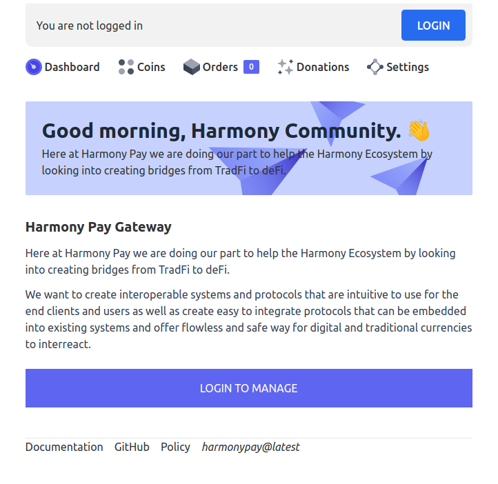
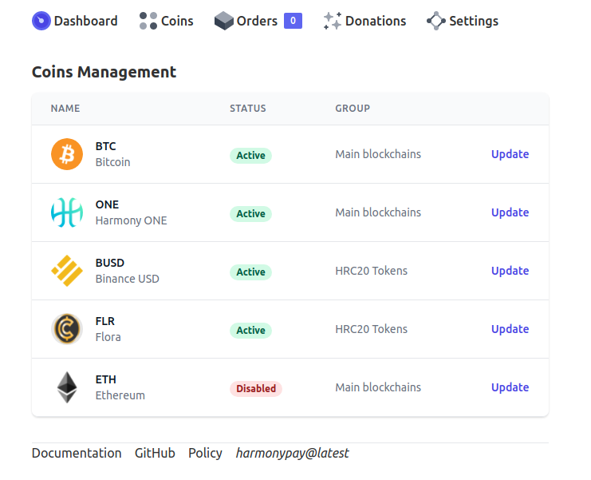

    
   
   <h3 align="center">HarmonyPay - Payment Gateway</h3>
   

   Accept Harmony ONE and HRC20 Tokens. Peer-to-peer transactions.
   

# HarmonyPay - Accept Harmony ONE and HRC20 tokens

Cryptocurrency payment gateway for WooCommerce and Easy Digital Downloads. Accept Harmony ONE and HRC20 Tokens. Peer-to-peer transactions.

### Description

Cryptocurrency payment gateway for WooCommerce and Easy Digital Downloads. Receive coins directly into the wallet of your choice.

### Key Features & Highlights

- 0% transaction fees
- No KYC or product restrictions
- Peer-to-peer transactions
- No redirection to 3rd parties or iframes
- Use any crypto wallet you want
- Automagically detect unique payments using one wallet address
- 1-Click payment buttons, MetaMask, One Wallet, etc.
- Fiat autosettlement enables you to connect to exchange(s) and instantly convert selected coins to fiat or stablecoins
- Donations widget shortcode generator
- Tor support
- 0-conf (mempool) support for some coins

### eCommerce platforms supported

- Easy Digital Downloads
- WooCommerce

### Cryptocurrencies supported

- Harmony ONE
- HRC20 Tokens
- Custom HRC20 Tokens
